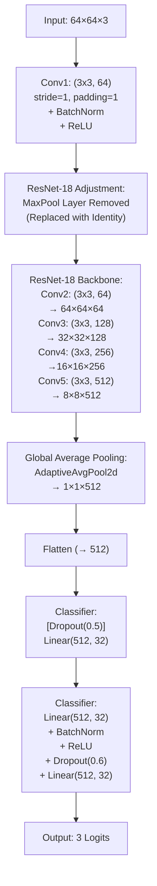
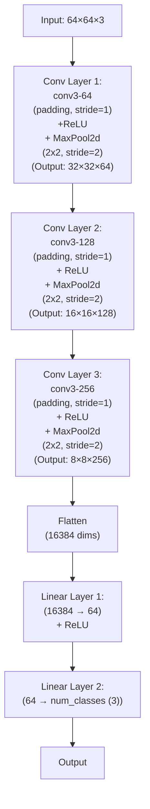

# 건국대학교 주관 행동모사 자율주행 경진대회

- #### **대회일:** 2024/06/27
- #### **내용:** 카메라로 촬영한 주행데이터를 기반으로 자율주행 딥러닝 모델을 개발하고, 1/10 size 차량에 탑재하여 자율주행 경기를 진행한다.
- #### **주임교수:** 건국대학교 기계항공공학부 김창완
- #### **팀원:** 건국대학교 응용통계학과 최대승, 건국대학교 기계공학과 석승연
- #### **수상이력:** 1등 대상 [Click Here](https://www.konkuk.ac.kr/konkuk/2096/subview.do?enc=Zm5jdDF8QEB8JTJGYmJzJTJGa29ua3VrJTJGMjU3JTJGMTEzMTA1OCUyRmFydGNsVmlldy5kbyUzRg==)
  
---
 

## 1. 서론 (Introduction)

본 연구에서는 소규모 이미지(64×64)를 대상으로 전이학습(Transfer Learning)을 활용한 이미지 분류 파이프라인을 제안한다.
 
기존의 대형 네트워크가 소규모 입력에 대해 과도한 다운샘플링을 발생시키는 문제를 개선하기 위해, 사전 학습된 ResNet 모델의 입력 계층 및 출력 계층을 수정하고, 다양한 데이터 증강 기법을 적용하여 모델의 일반화 성능을 향상시키고자 한다.
 
최종적으로 제안하는 모델은 자율주행 차량에 탑재되어 세 개의 클래스로 구성된 분류 문제(예: go, left, right)를 해결한다.
 
챕터5에서는 직접 고안한 모델, 전이학습 원본 모델, 전이학습 수정 모델을 비교해가며 최적의 모델을 찾아가는 실험과정을 자세하게 설명한다.

---
 

## 2. 이미지 데이터 전처리 (Preprocess Image Data)

### 2.1 데이터 수집

  - 연습 트랙에서 자동차를  수동주행하면서 전방 카메라로 주행 데이터를 취득한다.
  - 취득한 데이터는 직진, 좌회전, 우회전으로 구분하고 각각 0, 1, 2로 라벨링한다.
  - 그리고 각각 `/image/go`, `/image/left`, `/image/right` 디렉토리에 저장한다.

### 2.2 데이터 전처리
  - **1. 원본 이미지:** 카메라로 캡처한 raw 이미지의 사이즈는 (1500, 1000)이며, 실제 모습과 비교하면 180도 회전된 상태이다.
  - **2. 회전:** 이미지를 180도 회전시킵니다. (`cv2.flip(frame, -1)` 사용)
  - **3. 초기 리사이즈:** ROI 추출을 용이하게 하기 위해 이미지를 (512, 512) 크기로 리사이즈합니다.
  - **4. ROI 생성:** 상단 200픽셀을 제거하여 ROI를 생성합니다. (`frame = frame[200:,:]`)
  - **5. 최종 리사이즈:** 추출된 ROI 이미지를 모델 입력 사이즈인 (64, 64)로 리사이즈한다.

|direction|go|left|right|
|:---:|:---:|:---:|:---:|
|Preprocessed   images|  |  | |

### 2.3 데이터 저장 디렉토리
 -  image  
  ├── go : 0으로 라벨링된 직진 이미지  
  ├── left : 1로 라벨링된 좌회전 이미지   
  └── right : 2로 라벨링링된 우회전 이미지

### 2.4 데이 파일 다운로드
- [Click Here](https://drive.google.com/file/d/1aTDsimYZ3yXoyvhpsowJX1jH8MCZJUkK/view?usp=drive_link)
---
 

## 3. 데이터 증강 (Dataset and Data Augmentation)
### 3.1 데이터셋
- **데이터 로드:**  
  - 각 클래스에 해당하는 이미지들은 `/image/go`, `/image/left`, `/image/right` 디렉토리에서 OpenCV를 통해 로드된다.
  - 이미지는 BGR 포맷으로 읽혀지며, 이후 RGB로 변환된다.
  - 데이터는 float32 형식으로 변환된 후, 픽셀 값이 [0,255]에서 [-1,1] 범위로 정규화된다.
- **데이터 규모:**  
  전체 8531개의 이미지가 구성되어있으며 학습과 검증에 사용된다.
- **데이터 분할:**  
  전체 데이터셋은 학습용과 검증용으로 8:2의 비율로 분할된다.

### 3.2 커스텀 데이터셋 클래스
- **클래스 설계:**  
  `CustomImageDataset` 클래스는 이미지와 대응 라벨을 함께 저장하며, 데이터 증강 및 전처리를 위한 transform을 선택적으로 적용한다.
  학습 데이터는 transform을 적용하고, 검증 데이터는 transform을 적용하지 않는다.

- **전처리 과정:**  
  transform이 지정된 경우, 정규화된 이미지([-1,1] 범위])를 복원하여 [0,255] 범위의 PIL 이미지로 변환한 후 지정된 transform을 적용한다.
  그렇지 않으면 NumPy 배열을 텐서 형식으로 변환한다.

### 3.4 데이터 증강 (Data Augmentation)
- **데이터 증강 기법:**  
  학습 데이터에 적용된 증강은 모델이 다양한 입력 변형에 강인해지도록 돕는다. 사용한 기법들은 다음과 같다:

  1. **RandomRotation (최대 20도 회전):**  
     - **설명:** 이미지가 무작위로 -20도에서 +20도 사이에서 회전된다.  
     - **효과:** 회전된 이미지에서도 동일한 클래스를 인식할 수 있도록 하여, 방향 변화에 대한 모델의 강인성을 향상시킨다.
  
  2. **RandomAffine (최대 5% 평행 이동):**  
     - **설명:** 회전(degrees=0)은 수행하지 않고, 이미지가 가로와 세로 방향으로 최대 5%까지 평행 이동된다.  
     - **효과:** 객체의 위치 변화에 대응할 수 있도록 학습시켜, 위치 불변성을 높인다.
  
  3. **RandomResizedCrop (크롭 후 재조정):**  
     - **설명:** 원본 이미지의 임의의 부분을 크롭한 후, 64×64 크기로 재조정한다.  
     - **효과:** 다양한 구도와 크기를 가진 이미지 조각에 대해 학습하여, 카메라 각도의 미세한 변화에 대한 강인성을 향상시킨다.
  
  4. **ToTensor (텐서 변환):**  
     - **설명:** PIL 이미지 또는 NumPy 배열을 PyTorch 텐서로 변환하며, 자동으로 픽셀 값을 [0,1] 범위로 조정한다.
  
  5. **Normalize (정규화):**  
     - **설명:** ImageNet 데이터셋에서 사용된 평균([0.485, 0.456, 0.406])과 표준편차([0.229, 0.224, 0.225])로 각 채널별 정규화를 진행한다.  
     - **효과:** 사전학습된 모델과의 일관성을 유지하여 전이학습 효과를 극대화한다.
  
- **검증 데이터 처리:**  
  검증 데이터에는 데이터 증강 기법을 적용하지 않고, 단순히 ToTensor와 Normalize만 적용된다. 이는 모델 성능 평가 시 원본 이미지의 특성을 그대로 반영하기 위함이다.

---
 

## 4. 모델 아키텍처 및 수정 (Model Architecture and Modifications)

### 4.1 전이학습 모델 선택
- **모델 선택:**  
  사전학습된 ResNet 모델(ResNet-18 또는 ResNet-34)을 사용하며, 코드에서는 ResNet-18 기반의 전이학습을 기본으로 한다.
- **가중치 다운로드:**  
  PyTorch Hub를 통해 ImageNet으로 사전 학습된 가중치를 다운로드하여 초기 모델 파라미터로 사용한다.

### 4.2 네트워크 수정
- **입력 계층 수정:**  
  원래 ResNet의 첫 번째 합성곱 계층은 7×7 커널, stride=2, padding=3으로 설정되어 있으나, 이는 64×64 이미지에서는 과도한 다운샘플링을 발생시킨다.  
  → 따라서 첫 번째 conv layer를 3×3 커널, stride=1, padding=1로 재설정하여 해상도 손실을 줄인다.
  
- **MaxPool 레이어 제거:**  
  첫 번째 maxpool 계층을 Identity 함수로 대체하여, 초기 입력 해상도가 유지되도록 한다.
  
- **출력 계층 수정:**  
  기존의 1000 클래스 출력 대신, 중간 hidden layer(크기 32)를 포함한 Fully Connected (FC) 레이어 구조로 변경한다.  
  - 배치 정규화, ReLU 활성화, 드롭아웃(비율 0.6)을 적용하여 과적합을 방지하고 모델의 일반화 능력을 향상시킨다.
  - 최종 출력은 3개의 클래스에 맞게 구성된다.

---
 

## 5. 학습 전략 (Training Strategy)

### 5.1 학습 환경 및 디바이스 설정
- **디바이스:**  
  CUDA 사용 가능 시 GPU를, 그렇지 않으면 CPU를 활용하여 학습을 진행한다.

### 5.2 손실 함수 및 옵티마이저 설정
- **손실 함수:**  
  다중 분류 문제에 적합한 CrossEntropyLoss를 사용한다.
- **옵티마이저:**  
  Adam 옵티마이저를 사용하며, 초기 학습률은 1e-3, weight_decay는 1e-3로 설정된다.

### 5.3 학습률 스케줄링 및 조기 종료
- **학습률 스케줄러:**  
  ReduceLROnPlateau를 사용하여 검증 손실이 개선되지 않을 경우 학습률에 0.1씩 곱한다.
- **조기 종료 (Early Stopping):**  
  최대 120 에폭 동안 학습을 진행하며, 검증 손실이 개선되지 않으면 설정한 patience 이후 조기 종료를 수행한다. 가장 우수한 모델 가중치를 저장한 후, 최종 평가에 사용한다.

### 5.4 학습 루프 및 로그 기록
- **학습 단계:**  
  각 에폭마다 학습 데이터셋을 통해 손실과 정확도를 계산하고, 옵티마이저를 통해 모델 파라미터를 업데이트한다.
- **검증 단계:**  
  에폭 종료 후, 검증 데이터셋을 통해 모델 성능(손실 및 정확도)을 평가하며, 학습률 스케줄러에 해당 값을 전달하여 학습률을 조정한다.
- **로그 출력:**  
  에폭마다 현재 학습 손실, 검증 손실, 학습 및 검증 정확도, 학습률을 출력하여 학습 진행 상황을 모니터링한다.

---
 

## 6. 실험 및 파라미터 튜닝(Experiments and Parameter Tuning)

### 6.1 직접 설계한 초기 모델 A
- 컨볼루젼 층 표기방식:  
conv 'receptive field size' - 'number of channels'
- 학습 방법:  
SGD optimizer (lr=5*1e-3)
batch size 128

### 6.2 val loss를 기준으로 성능 실험
- 초기 모델 A부터 성능을 실험하며, val loss를 낮추기 위한 파인 튜닝을 진행하였다.
- A의 변형만으로는 성능 개선에 한계를 느꼈고, 이후 전이학습을 도입하게 되었다.

|model name|A|B|C|D|E|
|:---:|:---:|:---:|:---:|:---:|:---:|
|feature|	초기 설계 모델. SGD (lr=5*1e-3	|	A에 스케줄러(0.5배) 추가. min_lr=1e-6	|	B의 모든 relu 층마다 바로 직전에 배치 정규화 층을 추가	|	C의 배치 사이즈를 128에서 256으로 수정	|	D의 배치 사이즈를 256에서 512으로 수정|
|val loss||||||
|final val loss/acc||||||
|result|<small>val loss 값이 수렴하지 않고 진동하는 문제가 있다. 스케줄러 추가가 필요해보인다.</small>|<small>스케줄러 덕분에 val loss 값 진동 문제는 어느 정도 해결되었다. 하지만 train loss 값이 0에 수렴하지 않는 점을 근거로 모델의 깊이가 부족하다고 판단함.</small>|<small>이제 train loss값은 0에 수렴한다. 그리고 val loss는 epoch50 이전까지 크게 진동하다가 급격하게 0.6부근으로 수렴한다. 이처럼 val loss의 급격한 수렴현상의 원인은 스케줄러가 큰 진동 때문에 lr을 연달아 감소시킨 탓으로 판단했다. 따라서 학습 안정성을 줄일 필요가 있다고 판단했다.|<small>배치 사이즈를 증가시켜 배치의 분산이 줄어들고, 기울기 업데이트의 분산도 줄어들어서 학습이 안정적으로 변한다.|<small>D와 비교했을 때 val loss의 반등양상이 감소했고, 이는 오버피팅이 더 억제된 결과라고 판단했다.|	
|model name|F|G|H|I|J|
|feature|	E의 FC 층에 드롭아웃 (0.5) 추가|E의 FC 층에 드롭아웃 (0.8) 추가|G에 L2 정규화 (1e-3) 추가|G에 L2 정규화 (1e-4) 추가|H에 데이터 증강 (RandomRotation 20) 추가|
|val loss||||||
|final val loss/acc||||||
|	result|	val loss를 더 줄이기 위해 드롭아웃을 0.5비율로 추가했지만 성능 차이가 크지 않았다. 비율을 늘릴 필요가 있어보인다.	|	F보다 val loss가 더 빠르게 수렴한다. F보다 성능도 향상됐다.	|	val loss를 더 줄이기 위해 L2 정규화를 1e-3 가중치로 추가했지만, 추가 이전과 성능 차이가 크지 않았다. 가중치를 증가시킬 필요가 있어보인다.	|	L2 정규화 가중치를 1e-3에서 1e-2로 감소시켰지만, 감소 이전과 성능 차이가 크지 않았다. H를 유지하기로 결정했다.	|	val data와 train data의 차이가 커진 탓에 val loss의 수렴속도가 느려진 것으로 해석했다.	|
|model name|K|L|M|N|O|
|feature|J의 optimizer를 SGD에서 ADAM으로 교체했다. lr=5*1e-3 유지, L2가중치=1e-3 유지|J의 optimizer를 SGD에서 ADAM으로 교체했다. lr=5*1e-3 유지, L2가중치=1e-4로 수정|J의 optimizer를 SGD에서 ADAM으로 교체했다. lr=5*1e-3 유지, L2가중치=1e-2로 수정|L에서 lr을 5*1e-3에서 5*1e-2로 수정|L에서 lr을 5*1e-3에서 1*1e-3으로 수정|
|val loss||||||
|final val loss/acc||||||
|	result|	epoch 10 부근에서 val loss가 반등하는 오버피팅 문제가 발생했다.	|	K보다 final val loss가 작다.	|	L보다 final val loss가 크다.	|	L보다 final val loss가 크다.	|	L과 final loss가 비슷한 양상을 보인다. 성능개선에 한계를 느껴서 전이학습을 시도하기로 결정했다.	|
|model name|P|Q|R|S|T|
|feature||||||
|val loss||||||
|final val loss/acc||||||
|result||||||
|model name|U|V|W|X|Y|
|feature||||||
|val loss||||||
|final val loss/acc||||||
|result||||||
|model name|Z|AA|AB|AC|AD|
|feature||||||
|val loss||||||
|final val loss/acc||||||
|result||||||

---
 

## 7. 결과 시각화 및 최종 평가 (Results Visualization and Final Evaluation)

### 7.1 학습 곡선 시각화
- **손실 곡선:**  
  Matplotlib을 활용하여 에폭별 학습 손실과 검증 손실을 그래프로 시각화한다.
- **정확도 곡선:**  
  학습 정확도와 검증 정확도의 변화를 별도의 그래프로 나타내어, 모델의 수렴 및 일반화 성능을 직관적으로 확인할 수 있다.

### 7.2 최종 모델 평가
- **최적 모델 선택:**  
  조기 종료 기준에 따라 저장된 최적의 모델 가중치를 불러와 최종 평가를 진행한다.
- **평가 지표:**  
  전체 검증 데이터셋에 대해 최종 손실과 정확도를 계산하여 모델의 성능을 정량적으로 평가한다.

---
 

## 8. 결론 (Conclusion)

본 연구에서는 전이학습 기반의 ResNet 모델을 소규모 이미지 분류 문제에 효과적으로 적용하기 위한 종합적인 파이프라인을 제안하였다.  
- **주요 기여:**  
  - 소규모 이미지에 적합한 입력 계층 수정 및 maxpool 제거를 통한 해상도 보존  
  - 다양한 데이터 증강 기법(RandomRotation, RandomAffine, RandomResizedCrop 등)을 적용하여 모델의 일반화 성능 강화  
  - 사전 학습된 모델을 기반으로 한 출력 계층 수정 및 안정적인 학습 전략(학습률 스케줄링, 조기 종료) 구현  
- **실험 결과:**  
  제안한 방법을 통해 학습 과정에서 손실 및 정확도 변화를 면밀히 모니터링하였으며, 최종 평가에서 우수한 분류 성능을 확인할 수 있었다.
- **향후 연구 방향:**  
  다양한 데이터 증강 방법에 대해서 계획적으로 실험하는 방법을 공부하고 싶다.

---

# 페이션트 에포크 수정 필요
<table style="width:100%; table-layout: fixed; font-size:5px;">
  <colgroup>
    <col style="width:16.66%;">
    <col style="width:16.66%;">
    <col style="width:16.66%;">
    <col style="width:16.66%;">
    <col style="width:16.66%;">
    <col style="width:16.66%;">
  </colgroup>
  <tr>
    <td>model name</td>
    <td>A</td>
    <td>B</td>
    <td>C</td>
    <td>D</td>
    <td>E</td>
  </tr>
  <tr>
    <td>val loss</td>
    <td></td>
    <td></td>
    <td></td>
    <td></td>
    <td></td>
  </tr>
  <tr>
    <td>feature</td>
    <td>초기 설계 모델. SGD (lr=5*1e-3</td>
    <td>A에 스케줄러(0.5배) 추가. min_lr=1e-6</td>
    <td>B의 모든 relu 층마다 바로 직전에 배치 정규화 층을 추가</td>
    <td>C의 배치 사이즈를 128에서 256으로 수정</td>
    <td>D의 배치 사이즈를 256에서 512으로 수정</td>
  </tr>
  <tr>
    <td>final val loss, acc</td>
    <td>0.4735   0.7961</td>
    <td>0.4833   0.7950</td>
    <td>0.4744   0.8020</td>
    <td>0.4887   0.7903</td>
    <td>0.4939   0.7897</td>
  </tr>
  <tr>
    <td>evaluation</td>
    <td>val loss 값이 수렴하지 않고 진동하는 문제가 있다. 스케줄러 추가가 필요해보인다.</td>
    <td>스케줄러 덕분에 val loss 값 진동 문제는 어느 정도 해결되었다. 하지만 train loss 값이 0에 수렴하지 않는 점을 근거로 모델의 깊이가 부족하다고 판단함</td>
    <td>이제 train loss값은 0에 수렴한다. val loss는 epoch50 이전까지 크게 진동하다가 급격하게 0.6부근으로 수렴한다. 이처럼 val loss의 급격한 수렴현상의 원인은 스케줄러가 큰 진동 때문에 lr을 연달아 감소시킨 탓으로 판단했다. 따라서 학습 안정성 확보가 필요하다 판단했다.</td>
    <td>배치 사이즈를 증가시키니 배치의 분산이 줄어들고, 기울기 업데이트의 분산도 줄어들어서 학습이 안정적으로 변한다.</td>
    <td>D와 비교했을 때 val loss의 반등양상이 감소했고, 이는 오버피팅이 더 억제된 결과라고 판단했다.</td>
  </tr>
</table>

<table style="width:100%; table-layout: fixed; font-size:5px;">
  <colgroup>
    <col style="width:16.66%;">
    <col style="width:16.66%;">
    <col style="width:16.66%;">
    <col style="width:16.66%;">
    <col style="width:16.66%;">
    <col style="width:16.66%;">
  </colgroup>  
  <tr>
    <td>model name</td>
    <td>F</td>
    <td>G</td>
    <td>H</td>
    <td>I</td>
    <td>J</td>
  </tr>
  <tr>
    <td>val loss</td>
    <td></td>
    <td></td>
    <td></td>
    <td></td>
    <td></td>
  </tr>
    <tr>
    <td>feature</td>
    <td>E의 FC 층에 드롭아웃 (0.5) 추가</td>
    <td>E의 FC 층에 드롭아웃 (0.8) 추가</td>
    <td>G에 L2 정규화 (1e-3) 추가</td>
    <td>G에 L2 정규화 (1e-2) 추가</td>
    <td>H에 RandomRotation 10deg 추가</td>
  </tr>
  <tr>
    <td> final val loss, acc </td>
    <td> 0.5110   0.7873 </td>
    <td> 0.4880   0.8002 </td>
    <td> 0.4879   0.7985 </td>
    <td> 0.4932   0.7967 </td>
    <td> 0.4743   0.8020 </td>
  </tr>
  <tr>
    <td>evaluation</td>
    <td> val loss를 더 줄이기 위해 드롭아웃을 0.5비율로 추가했지만 성능 차이가 크지 않았다. 드롭아웃 비율을 늘릴 필요가 있어보인다.</td>
    <td> F보다 val loss가 더 빠르게 수렴한다. F보다 성능도 향상됐다.</td>
    <td>val loss를 더 줄이기 위해 L2 정규화를 1e-3 가중치로 추가했지만, 추가 이전과 성능 차이가 크지 않았다. 가중치를 증가시킬 필요가 있어보인다.</td>
    <td>L2 정규화 가중치를 1e-3에서 1e-2로 감소시켰지만, 감소 이전과 성능 차이가 크지 않았다. H를 유지하기로 결정했다. </td>
    <td>val data와 train data의 차이가 커진 탓에 val loss의 수렴속도가 느려진 것으로 해석했다.</td>
  </tr>
</table>

<table style="width:100%; table-layout: fixed; font-size:5px;">
  <tr>
    <td>model name</td>
    <td> K</td>
    <td> L</td>
    <td> M</td>
    <td> N</td>
    <td> O</td>
  </tr>
  <tr>
    <td>val loss</td>
    <td></td>
    <td></td>
    <td></td>
    <td></td>
    <td></td>
  </tr>
  <tr>
    <td>feature</td>
    <td> J의 optimizer를 SGD에서 ADAM으로 교체했다. lr=5*1e-3 유지, L2가중치=1e-3 유지</td>
    <td> J의 optimizer를 SGD에서 ADAM으로 교체했다. lr=5*1e-3 유지, L2가중치=1e-4로 수정</td>
    <td> J의 optimizer를 SGD에서 ADAM으로 교체했다. lr=5*1e-3 유지, L2가중치=1e-2로 수정</td>
    <td> L에서 lr을 5*1e-3에서 5*1e-2로 수정</td>
    <td> L에서 lr을 5*1e-3에서 1*1e-3으로 수정</td>
  </tr>
  <tr>
    <td>final val loss, acc</td>
    <td>  0.4497   0.8102</td>
    <td>  0.4548   0.8061</td>
    <td>  0.4725   0.8032</td>
    <td>  0.5032   0.7979</td>
    <td>  0.4568   0.8002</td>
  </tr>
  <tr>
    <td>evaluation</td>
    <td> epoch 10 부근에서 val loss가 반등하는 오버피팅 문제가 발생했다.</td>
    <td> K보다 final val loss가 작다.</td>
    <td> L보다 final val loss가 크다.</td>
    <td> L보다 final val loss가 크다.</td>
    <td> L과 final loss가 비슷한 양상을 보인다. 성능개선에 한계를 느껴서 전이학습에서 파인튜닝을 시도하기로 결정했다.</td>
  </tr>
</table>

<table style="width:100%; table-layout: fixed; font-size:5px;">  
  <tr>
    <td>model name</td>
    <td> P</td>
    <td> Q</td>
    <td> R</td>
    <td> S</td>
    <td> T</td>
  </tr>
  <tr>
    <td>val loss</td>
    <td></td>
    <td></td>
    <td></td>
    <td></td>
    <td></td>
  </tr>
  <tr>
    <td>feature</td>
    <td> </td>
    <td> </td>
    <td> </td>
    <td> </td>
    <td> </td>
  </tr>
  <tr>
    <td>final val loss, acc</td>
    <td> </td>
    <td> </td>
    <td> </td>
    <td> </td>
    <td> </td>
  </tr>
  <tr>
    <td>evaluation</td>
    <td> </td>
    <td> </td>
    <td> </td>
    <td> </td>
    <td> </td>
  </tr>
</table>

<table style="width:100%; table-layout: fixed; font-size:5px;">  
  <tr>
    <td>model name</td>
    <td> U</td>
    <td> V</td>
    <td> W</td>
    <td> X</td>
    <td> Y</td>
  </tr>

  <tr>
    <td>val loss</td>
    <td></td>
    <td></td>
    <td></td>
    <td></td>
    <td></td>
  </tr>
  <tr>
    <td>feature</td>
    <td> </td>
    <td> </td>
    <td> </td>
    <td> </td>
    <td> </td>
  </tr>
  <tr>
    <td>final val loss, acc</td>
    <td> </td>
    <td> </td>
    <td> </td>
    <td> </td>
    <td> </td>
  </tr>
  <tr>
    <td>evaluation</td>
    <td> </td>
    <td> </td>
    <td> </td>
    <td> </td>
    <td> </td>
  </tr>
</table>

<table style="width:100%; table-layout: fixed; font-size:5px;">  
  <tr>
    <td>model name</td>
    <td> Z</td>
    <td> AA</td>
    <td> AB</td>
    <td> AC</td>
    <td> </td>
  </tr>
  <tr>
    <td>val loss</td>
    <td></td>
    <td></td>
    <td></td>
    <td></td>
    <td></td>
  </tr>
  <tr>
    <td>feature</td>
    <td> </td>
    <td> </td>
    <td> </td>
    <td> </td>
    <td> </td>
  </tr>
  <tr>
    <td>final val loss, acc</td>
    <td> </td>
    <td> </td>
    <td> </td>
    <td> </td>
    <td> </td>
  </tr>
  <tr>
    <td>evaluation</td>
    <td> </td>
    <td> </td>
    <td> </td>
    <td> </td>
    <td> </td>
  </tr>

</table>