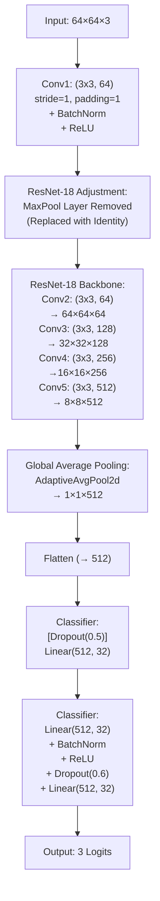

# 건국대학교 주관 행동모사 자율주행 경진대회

- #### **내용**: 카메라로 촬영한 주행데이터를 기반으로 자율주행 딥러닝 모델 개발

- #### **대회일**: 2024/06/27

- #### **주임교수**: 건국대학교 기계항공공학부 김창완

- #### **팀원**: 건국대학교 응용통계학과 최대승, 건국대학교 기계공학과 석승연

- #### **수상이력**: 1등 대상 [Click Here](https://www.konkuk.ac.kr/konkuk/2096/subview.do?enc=Zm5jdDF8QEB8JTJGYmJzJTJGa29ua3VrJTJGMjU3JTJGMTEzMTA1OCUyRmFydGNsVmlldy5kbyUzRg==)
  
---------
<br>


# 
Resnet 전이학습을 활용한 이미지 분류 모델 제작
<br>
이 프로젝트는 ResNet 전이학습을 활용하여 딥러닝 모델을 제작하고, 3가지 방향(Go, Left, Right) 이미지 분류 작업을 수행합니다.
<br>
카메라로 촬영한 주행 데이터를 전처리하고 데이터 증강 처리합니다.
<br><br>
## 주요 기능

- **Custom Dataset 구현:** 이미지 데이터와 라벨을 기반으로 PyTorch Dataset 클래스를 커스터마이징
- **데이터 증강 및 전처리:** 학습 데이터에 대해 랜덤 회전, 평행 이동, 크롭을 증강 기법으로 적용
- **전이학습 기반 모델 구성:** 사전 학습된 ResNet-18 모델을 작은 64x64 입력 이미지에 맞게 수정하고, 최종 Fully Connected (FC) 레이어를 3 클래스 분류에 맞게 재구성
- **학습 및 검증 루프:** CrossEntropyLoss, Adam Optimizer, ReduceLROnPlateau 스케줄러를 사용하여 학습 진행 및 Early Stopping 적용
- **성능 시각화:** 학습 및 검증 Loss, Accuracy 곡선을 시각화하여 학습 과정을 모니터링
- **모델 저장 및 평가:** 베스트 모델 저장 후 최종 검증 데이터셋에 대해 평가 진행 <br><br>


## 성능


<br><br>
## 데이터 구조

- **이미지 전처리:**
  - **1. 원본 이미지:** 라즈베리 파이로 캡처한 raw 이미지의 사이즈는 (1500, 1000)입니다.
  - **2. 회전:** 이미지를 180도 회전시킵니다. (`cv2.flip(frame, -1)` 사용)
  - **3. 초기 리사이즈:** ROI 추출을 용이하게 하기 위해 이미지를 (512, 512) 크기로 리사이즈합니다.
  - **4. ROI 생성:** 상단 200픽셀을 제거하여 ROI를 생성합니다. (`frame = frame[200:,:]`)
  - **5. 최종 리사이즈:** 추출된 ROI 이미지를 모델 입력 사이즈인 (64, 64)로 리사이즈하여 저장합니다. <br>


- **순서대로 go, left, right 이미지** <br>

    
  
  


- **이미지 디렉토리:**  
  image <br>
  ├── go : "Go" 이미지들 <br>
  ├── left : "Left" 이미지들   <br>
  └── right : "Right" 이미지들 <br>


<br><br>
## 모델 아키텍처 상세 설명

본 프로젝트에서는 전이학습 기법을 활용하여 사전 학습된 **ResNet-18** 모델을 기반으로 이미지 분류기를 구성하였습니다. 아래는 모델 아키텍처의 각 구성 요소에 대한 상세 설명입니다.

### 1. ResNet-18 기반 모델
- **사전 학습 가중치 사용:**  
  - `models.resnet18(weights=models.ResNet18_Weights.DEFAULT)`를 통해 ImageNet 데이터셋으로 사전 학습된 가중치를 사용하여 모델을 초기화합니다.
  
- **첫 번째 Convolution 레이어 수정:**  
  - **원래 구조:** 7x7 커널, stride=2, padding=3  
  - **수정 후 구조:** 3x3 커널, stride=1, padding=1  
  - **이유:** 작은 해상도(64x64)의 이미지에서 과도한 다운샘플링을 방지하고, 세밀한 특징을 추출하기 위해 변경되었습니다.
  
- **MaxPooling 레이어 제거:**  
  - 기존 ResNet-18은 첫 번째 Convolution 이후 MaxPooling 레이어를 사용하여 해상도를 줄입니다.
  - 작은 이미지에서는 중요한 공간 정보를 잃을 수 있으므로, 이를 `nn.Identity()`로 대체하여 제거하였습니다.

### 2. Fully Connected (FC) 레이어 재구성
- **기존 FC 레이어 교체:**  
  - ImageNet 분류를 위해 설계된 1000 클래스 출력 대신, 3 클래스(Go, Left, Right) 분류를 위한 레이어로 재구성합니다.
  
- **세부 구성:**  
  - **중간 Hidden Layer:**  
    - **Linear Layer:** 입력 feature 수(`num_features`)를 32개의 뉴런으로 축소  
    - **Batch Normalization:** 학습 안정성과 수렴 속도 향상을 위해 적용  
    - **ReLU 활성화 함수:** 비선형성을 부여하여 모델 성능을 향상  
    - **Dropout (0.6):** 과적합을 방지하기 위해 높은 확률로 뉴런을 랜덤하게 비활성화  
  - **최종 출력 레이어:**  
    - 32개의 뉴런을 3개의 클래스 출력으로 변환하는 Linear 레이어를 사용하여 최종 분류 결과를 도출합니다.

### 3. 전체 모델 흐름
1. **입력 처리:**  
   - 입력 이미지의 크기는 64x64이며, RGB 채널로 구성됩니다.
2. **Feature Extraction:**  
   - 수정된 첫 번째 Convolution 레이어를 포함한 ResNet-18 블록들을 통과하며 이미지의 고수준 특징을 추출합니다.
3. **분류 단계:**  
   - 추출된 feature는 Global Average Pooling 등을 통해 flatten된 후, 재구성된 FC 레이어를 거쳐 3개의 클래스에 대한 확률로 변환됩니다.

이와 같은 모델 아키텍처 설계는 작은 해상도의 이미지에서도 충분한 특징 추출 및 분류 성능을 발휘할 수 있도록 최적화되었습니다.





<br><br>
## 학습 과정

- **데이터 분할:**  
  - 전체 데이터의 80%를 학습, 20%를 검증 데이터로 사용합니다.
- **손실 함수:**  
  - CrossEntropyLoss (다중 분류 문제에 적합)
- **최적화 알고리즘:**  
  - Adam Optimizer (learning rate=1e-3, weight_decay=1e-3)
- **학습률 스케줄링:**  
  - ReduceLROnPlateau: 검증 Loss 기준으로 학습률을 동적으로 조정합니다.
- **Early Stopping:**  
  - 검증 Loss 개선이 일정 에폭 동안 없을 경우 조기 종료를 통해 오버피팅을 방지합니다.
- **학습 에폭:**  
  - 최대 120 에폭 (Early Stopping 조건에 따라 조기 종료될 수 있음)

<br><br>
## 실행 방법

1. **환경 설정 및 의존성 설치**  
   Python 및 필요한 라이브러리(PyTorch, Torchvision, OpenCV, NumPy, Matplotlib, scikit-learn)를 설치합니다.
   ```bash
   pip install torch torchvision opencv-python numpy matplotlib scikit-learn

2. **데이터 준비**
   각 클래스 별로 `/image/go`, `/image/left`, `/image/right` 경로에 이미지 파일을 배치합니다.
   <br>이미지 파일 다운로드 [Click Here](https://drive.google.com/file/d/1aTDsimYZ3yXoyvhpsowJX1jH8MCZJUkK/view?usp=drive_link)


4. **코드 실행**
   학습 스크립트를 실행합니다.

    ```bash
   python model.py


---
<br>

## 1. 서론 (Introduction)

본 연구에서는 소규모 이미지(64×64)를 대상으로 전이학습(Transfer Learning)을 활용한 이미지 분류 파이프라인을 제안한다.
<br>
기존의 대형 네트워크가 소규모 입력에 대해 과도한 다운샘플링을 발생시키는 문제를 개선하기 위해, 사전 학습된 ResNet 모델의 입력 계층 및 출력 계층을 수정하고, 다양한 데이터 증강 기법을 적용하여 모델의 일반화 성능을 향상시키고자 한다.
<br>
최종적으로 제안하는 모델은 자율주행 차량에 탑재되어 세 개의 클래스로 구성된 분류 문제(예: go, left, right)를 해결한다.

---
<br>

## 2. 데이터셋 및 전처리 (Dataset and Preprocessing)

### 2.1 데이터 수집 및 정제
- **데이터 로드:**  
  각 클래스에 해당하는 이미지들은 `/image/go`, `/image/left`, `/image/right` 디렉토리에서 OpenCV를 통해 로드된다.
- **이미지 전처리:**  
  - 이미지는 BGR 포맷으로 읽혀지며, 이후 RGB로 변환된다.
  - 데이터는 float32 형식으로 변환된 후, 픽셀 값이 [0,255]에서 [-1,1] 범위로 정규화된다.
- **데이터 규모:**  
  전체 8531개의 이미지가 구성되어있으며 학습과 검증에 사용된다.
- **데이터 분할:**  
  전체 데이터셋은 학습용과 검증용으로 8:2의 비율로 분할된다.

### 2.2 커스텀 데이터셋 클래스
- **클래스 설계:**  
  `CustomImageDataset` 클래스는 이미지와 대응 라벨을 함께 저장하며, 데이터 증강 및 전처리를 위한 transform을 선택적으로 적용한다.
  학습 데이터는 transform을 적용하고, 검증 데이터는 transform을 적용하지 않는다.

- **전처리 과정:**  
  transform이 지정된 경우, 정규화된 이미지([-1,1] 범위])를 복원하여 [0,255] 범위의 PIL 이미지로 변환한 후 지정된 transform을 적용한다.
  그렇지 않으면 NumPy 배열을 텐서 형식으로 변환한다.

### 2.3 데이터 증강 (Data Augmentation)

  
- **데이터 증강 기법:**  
  학습 데이터에 적용된 증강은 모델이 다양한 입력 변형에 강인해지도록 돕는다. 주요 기법은 다음과 같다:

  1. **RandomRotation (최대 20도 회전):**  
     - **설명:** 이미지가 무작위로 -20도에서 +20도 사이에서 회전된다.  
     - **효과:** 회전된 이미지에서도 동일한 클래스를 인식할 수 있도록 하여, 방향 변화에 대한 모델의 강인성을 향상시킨다.
  
  2. **RandomAffine (최대 5% 평행 이동):**  
     - **설명:** 회전(degrees=0)은 수행하지 않고, 이미지가 가로와 세로 방향으로 최대 5%까지 평행 이동된다.  
     - **효과:** 객체의 위치 변화에 대응할 수 있도록 학습시켜, 위치 불변성을 높인다.
  
  3. **RandomResizedCrop (크롭 후 재조정):**  
     - **설명:** 원본 이미지의 임의의 부분을 크롭한 후, 64×64 크기로 재조정한다.  
     - **효과:** 다양한 구도와 크기를 가진 이미지 조각에 대해 학습하여, 카메라 각도의 미세한 변화에 대한 강인성을 향상시킨다.
  
  4. **ToTensor (텐서 변환):**  
     - **설명:** PIL 이미지 또는 NumPy 배열을 PyTorch 텐서로 변환하며, 자동으로 픽셀 값을 [0,1] 범위로 조정한다.
  
  5. **Normalize (정규화):**  
     - **설명:** ImageNet 데이터셋에서 사용된 평균([0.485, 0.456, 0.406])과 표준편차([0.229, 0.224, 0.225])로 각 채널별 정규화를 진행한다.  
     - **효과:** 사전학습된 모델과의 일관성을 유지하여 전이학습 효과를 극대화한다.
  
- **검증 데이터 처리:**  
  검증 데이터에는 데이터 증강 기법을 적용하지 않고, 단순히 ToTensor와 Normalize만 적용된다. 이는 모델 성능 평가 시 원본 이미지의 특성을 그대로 반영하기 위함이다.

---
<br>

## 3. 모델 아키텍처 및 수정 (Model Architecture and Modifications)

### 3.1 전이학습 모델 선택
- **모델 선택:**  
  사전학습된 ResNet 모델(ResNet-18 또는 ResNet-34)을 사용하며, 코드에서는 ResNet-18 기반의 전이학습을 기본으로 한다.
- **가중치 다운로드:**  
  PyTorch Hub를 통해 ImageNet으로 사전 학습된 가중치를 다운로드하여 초기 모델 파라미터로 사용한다.

### 3.2 네트워크 수정
- **입력 계층 수정:**  
  원래 ResNet의 첫 번째 합성곱 계층은 7×7 커널, stride=2, padding=3으로 설정되어 있으나, 이는 64×64 이미지에서는 과도한 다운샘플링을 발생시킨다.  
  → 따라서 첫 번째 conv layer를 3×3 커널, stride=1, padding=1로 재설정하여 해상도 손실을 줄인다.
  
- **MaxPool 레이어 제거:**  
  첫 번째 maxpool 계층을 Identity 함수로 대체하여, 초기 입력 해상도가 유지되도록 한다.
  
- **출력 계층 수정:**  
  기존의 1000 클래스 출력 대신, 중간 hidden layer(크기 32)를 포함한 Fully Connected (FC) 레이어 구조로 변경한다.  
  - 배치 정규화, ReLU 활성화, 드롭아웃(비율 0.6)을 적용하여 과적합을 방지하고 모델의 일반화 능력을 향상시킨다.
  - 최종 출력은 3개의 클래스에 맞게 구성된다.

---
<br>

## 4. 학습 전략 (Training Strategy)

### 4.1 학습 환경 및 디바이스 설정
- **디바이스:**  
  CUDA 사용 가능 시 GPU를, 그렇지 않으면 CPU를 활용하여 학습을 진행한다.

### 4.2 손실 함수 및 옵티마이저 설정
- **손실 함수:**  
  다중 분류 문제에 적합한 CrossEntropyLoss를 사용한다.
- **옵티마이저:**  
  Adam 옵티마이저를 사용하며, 초기 학습률은 1e-3, weight_decay는 1e-3로 설정된다.

### 4.3 학습률 스케줄링 및 조기 종료
- **학습률 스케줄러:**  
  ReduceLROnPlateau를 사용하여 검증 손실이 개선되지 않을 경우 학습률에 0.1씩 곱한다.
- **조기 종료 (Early Stopping):**  
  최대 120 에폭 동안 학습을 진행하며, 검증 손실이 개선되지 않으면 설정한 patience 이후 조기 종료를 수행한다. 가장 우수한 모델 가중치를 저장한 후, 최종 평가에 사용한다.

### 4.4 학습 루프 및 로그 기록
- **학습 단계:**  
  각 에폭마다 학습 데이터셋을 통해 손실과 정확도를 계산하고, 옵티마이저를 통해 모델 파라미터를 업데이트한다.
- **검증 단계:**  
  에폭 종료 후, 검증 데이터셋을 통해 모델 성능(손실 및 정확도)을 평가하며, 학습률 스케줄러에 해당 값을 전달하여 학습률을 조정한다.
- **로그 출력:**  
  에폭마다 현재 학습 손실, 검증 손실, 학습 및 검증 정확도, 학습률을 출력하여 학습 진행 상황을 모니터링한다.

---
<br>

## 5. 실험 및 파라미터 튜닝(Experiments and Parameter Tuning)

### 5.1 여러가지 조건에서 실

|제목|내용|설명|
|:---:|:---:|:---:|
|a|f|g|
|b|e|h|
|c|d|i|


---
<br>

## 6. 결과 시각화 및 최종 평가 (Results Visualization and Final Evaluation)

### 6.1 학습 곡선 시각화
- **손실 곡선:**  
  Matplotlib을 활용하여 에폭별 학습 손실과 검증 손실을 그래프로 시각화한다.
- **정확도 곡선:**  
  학습 정확도와 검증 정확도의 변화를 별도의 그래프로 나타내어, 모델의 수렴 및 일반화 성능을 직관적으로 확인할 수 있다.

### 6.2 최종 모델 평가
- **최적 모델 선택:**  
  조기 종료 기준에 따라 저장된 최적의 모델 가중치를 불러와 최종 평가를 진행한다.
- **평가 지표:**  
  전체 검증 데이터셋에 대해 최종 손실과 정확도를 계산하여 모델의 성능을 정량적으로 평가한다.

---
<br>

## 7. 결론 (Conclusion)

본 연구에서는 전이학습 기반의 ResNet 모델을 소규모 이미지 분류 문제에 효과적으로 적용하기 위한 종합적인 파이프라인을 제안하였다.  
- **주요 기여:**  
  - 소규모 이미지에 적합한 입력 계층 수정 및 maxpool 제거를 통한 해상도 보존  
  - 다양한 데이터 증강 기법(RandomRotation, RandomAffine, RandomResizedCrop 등)을 적용하여 모델의 일반화 성능 강화  
  - 사전 학습된 모델을 기반으로 한 출력 계층 수정 및 안정적인 학습 전략(학습률 스케줄링, 조기 종료) 구현  
- **실험 결과:**  
  제안한 방법을 통해 학습 과정에서 손실 및 정확도 변화를 면밀히 모니터링하였으며, 최종 평가에서 우수한 분류 성능을 확인할 수 있었다.
- **향후 연구 방향:**  
  다양한 데이터 증강 방법에 대해서 계획적으로 실험하는 방법을 공부하고 싶다.

---